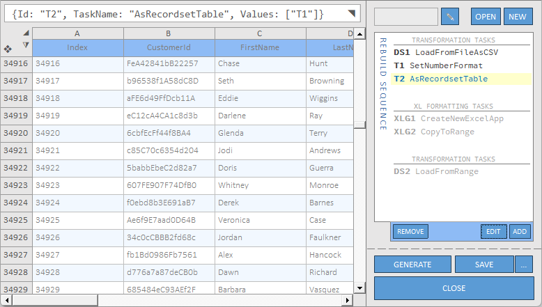

# __ds3x__
WIN32 / WIN64 / VBA7 <small><i>(MS Office 2010+)</i></small>

This repository contains both; [ds3x](./docs/ds3x-lib/README.md), a **lightweight MSAccess (VBA) shared library** providing a dead simple <u>abstraction</u> over operating on lists and table-like types of data collections and, the [dsLiveEd](./docs/live-editor-app/README.md), a **PowerQuery-like MSAccess Application** for managing automation tasks of data manipulation or direct-data manipulation with it's **Live Editor** interface. 

<blockquote>
Current releases are pretty stable but this is still in <b>active development</b>, being released earlier than planned so <b>anything can be subject to change</b>. Also, I'm still considering to use a custom <b>ArrayList</b> implementation to get rid of the <code>.NET Framework v3.5</code> dependency.
</blockquote>
 

This documentation is still largely incomplete.
  

### __dsLiveEd__

Read the __dsLiveEd__ docs [here](./docs/live-editor-app/README.md).

  

### __ds3x__

Read the **ds3x** shared library docs [here](./docs/ds3x-lib/README.md).

#### __Main collection classes__

  - __[ArrayListEx](./docs/ds3x-lib/ArrayListEx.md)__ - *`.NET Framework v3.5`'s `ArrayList` wrapper.*
  - __[Array2dEx](./docs/ds3x-lib/Array2dEx.md)__ <kbd><code>__IMMUTABLE__</code></kbd> - *`VBA`'s built-in `2D Array` wrapper.*
  - __[DictionaryEx](./docs/ds3x-lib/DictionaryEx.md)__ - *`Scripting.Dictionary` wrapper.*
  - __[RecordsetEx](./docs/ds3x-lib/RecordsetEx.md)__ - *`ADODB.Recordset` wrapper.*
  - __[xlSheetsEx](./docs/ds3x-lib/xlSheetsEx.md)__ - *`CSV`/`Excel` wrapper.*
  - __[dsTable](./docs/ds3x-lib/dsTable.md)__ <kbd><code>__IMMUTABLE__</code></kbd> - *Greatly simplifies working w/ table-like collections (holding column-related info, not just data).*
  

## __Known limitations__

- All collection-type classes are limited to VBA's `Long` capacity, `2,147,483,647` rows x `2,147,483,647` columns, being `4,611,686,014,132,420,608` cells in total.
 <small><i>(There's a task for de live editor app that creates a `2,100,000,000 * 1,000` sample table for quick development which only consumes about `17MB` of VMem and takes less than a second to generate.)</i></small>
- No support implemented for `Mac` or `MS Office` versions previous to 2010.

